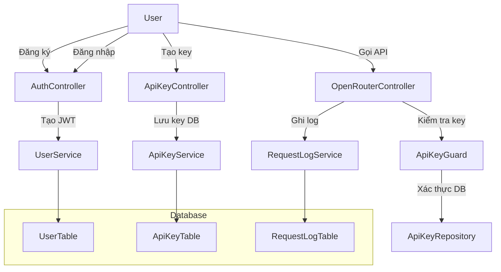

# Kế hoạch: Tạo tài khoản & Lynx AI Key Management

## Tổng quan kiến trúc

Hệ thống sẽ thêm 3 module chính:

1. **User Management** - Đăng ký, đăng nhập, quản lý profile
2. **API Key Management** - Tạo, quản lý, xóa Lynx AI keys
3. **Audit Logging** - Ghi log chi tiết mọi hoạt động API

## Flow dữ liệu tổng thể




## 1. Database Entities

### 1.1 User Entity (`src/modules/database/entities/user.entity.ts`)

```typescript
@Entity('users')
class UserEntity extends BaseEntity {
    @Column({ unique: true })
    email: string;
    
    @Column()
    hashedPassword: string;
    
    @Column({ nullable: true })
    displayName: string;
    
    @Column({ default: 'user' })
    role: 'user' | 'admin';
    
    @Column({ default: true })
    isActive: boolean;
    
    @OneToMany(() => ApiKeyEntity, apiKey => apiKey.user)
    apiKeys: ApiKeyEntity[];
    
    @OneToMany(() => RequestLogEntity, log => log.user)
    logs: RequestLogEntity[];
}
```

### 1.2 ApiKey Entity (`src/modules/database/entities/api-key.entity.ts`)

```typescript
@Entity('api_keys')
class ApiKeyEntity extends BaseEntity {
    @Column({ unique: true })
    key: string; // Format: sk-lynxai-{prefix}-{uuid}
    
    @Column()
    name: string; // Tên tự đặt: "Production Key", "Testing Key"
    
    @Column({ nullable: true })
    lastUsedAt: Date;
    
    @Column({ default: 0 })
    totalRequests: number;
    
    @ManyToOne(() => UserEntity, user => user.apiKeys)
    user: UserEntity;
    
    @Column()
    userId: string;
}
```

### 1.3 RequestLog Entity (`src/modules/database/entities/request-log.entity.ts`)

```typescript
@Entity('request_logs')
class RequestLogEntity extends BaseEntity {
    @Column()
    endpoint: string;
    
    @Column({ type: 'jsonb', nullable: true })
    requestBody: any;
    
    @Column({ type: 'jsonb', nullable: true })
    responseBody: any;
    
    @Column()
    statusCode: number;
    
    @Column()
    method: string;
    
    @Column({ nullable: true })
    model: string;
    
    @Column({ nullable: true })
    promptTokens: number;
    
    @Column({ nullable: true })
    completionTokens: number;
    
    @Column({ nullable: true })
    totalTokens: number;
    
    @Column({ type: 'decimal', nullable: true })
    estimatedCost: number;
    
    @Column()
    duration: number; // ms
    
    @ManyToOne(() => UserEntity, user => user.logs)
    user: UserEntity;
    
    @Column()
    userId: string;
    
    @ManyToOne(() => ApiKeyEntity)
    apiKey: ApiKeyEntity;
    
    @Column()
    apiKeyId: string;
}
```

## 2. User & Auth Module

### 2.1 DTOs (`src/modules/api/dtos/`)

- `CreateUserDto`: email, password, displayName
- `LoginDto`: email, password  
- `UserResponseDto`: id, email, displayName, role, createdAt
- `TokenResponseDto`: accessToken, refreshToken

### 2.2 Auth Controller (`src/modules/api/controllers/auth.controller.ts`)

```
POST /auth/register     - Đăng ký user mới
POST /auth/login        - Đăng nhập, nhận JWT
POST /auth/refresh      - Refresh token
GET  /auth/me           - Lấy thông tin user hiện tại
```

### 2.3 JWT Authentication

- Bỏ comment `JwtAuthGuard` hiện có (`src/modules/api/guards/jwt-auth.guard.ts`)
- Integrate với `@nestjs/passport` và `passport-jwt`
- Sử dụng config JWT đã có trong `src/modules/api/configs/auth.ts`

## 3. API Key Module

### 3.1 DTOs

- `CreateApiKeyDto`: name (tên key), prefix (optional)
- `ApiKeyResponseDto`: id, key, name, createdAt, lastUsedAt, totalRequests

### 3.2 Key Generation Logic

- Format: `sk-lynxai-{prefix}-{uuidv4}`
- Prefix mặc định: `user-{user-id-short}` hoặc custom
- Key được hash trước khi lưu vào DB (bcrypt)

### 3.3 ApiKey Controller (`src/modules/api/controllers/api-key.controller.ts`)

```
GET    /api-keys          - Liệt kê tất cả key của user
POST   /api-keys          - Tạo key mới
DELETE /api-keys/:id      - Xóa key
```

### 3.4 Refactor ApiKeyGuard

- Thay thế hardcoded keys với kiểm tra từ database
- Cập nhật `totalRequests` và `lastUsedAt` khi key được sử dụng

## 4. Audit Logging System

### 4.1 Logging Interceptor (`src/shared/interceptors/logging.interceptor.ts`)

- Intercept mọi request đến OpenRouter endpoints
- Ghi log trước/sau khi xử lý
- Tính toán duration, token usage từ response

### 4.2 RequestLog Service

- Lưu chi tiết request/response (trừ sensitive data nếu cần)
- Tính estimated cost dựa trên model và token count
- Liên kết với user và apiKey

### 4.3 Log Controller (`src/modules/api/controllers/log.controller.ts`)

```
GET /logs              - Xem lịch sử sử dụng của user
GET /logs/:id          - Xem chi tiết 1 log
GET /logs/stats        - Thống kê sử dụng (tokens, cost theo thời gian)
```

## 5. API Response Format

Tuân theo StandardResponseDto đã có (`src/shared/dtos/standard-response.dto.ts`):

```typescript
{
  "statusCode": 200,
  "message": "Success message",
  "data": { /* actual data */ },
  "pagination": { /* for paginated responses */ },
  "timestamp": "2026-04-01T10:30:00Z"
}
```

## 6. Swagger Documentation

Áp dụng best practices t��� `swagger-guide.mdc`:

- Tất cả endpoints có `@ApiTags`, `@ApiOperation`
- Tất cả DTOs có `@ApiProperty`
- Sử dụng `StandardResponseDto<T>` trong `@ApiResponse`
- Bearer auth cho protected endpoints

## 7. Migration Script

Tạo migration để thêm 3 bảng mới:

```sql
CREATE TABLE users (...);
CREATE TABLE api_keys (...);
CREATE TABLE request_logs (...);
```

## 8. Testing Strategy

1. Unit tests cho services
2. Integration tests cho controllers
3. E2E tests cho authentication flow
4. Test rate limiting với user-specific quotas

## Files sẽ tạo mới

1. `src/modules/database/entities/user.entity.ts`
2. `src/modules/database/entities/api-key.entity.ts`
3. `src/modules/database/entities/request-log.entity.ts`
4. `src/modules/database/repositories/user.repository.ts`
5. `src/modules/database/repositories/api-key.repository.ts`
6. `src/modules/database/repositories/request-log.repository.ts`
7. `src/modules/api/dtos/user/` (4 DTOs)
8. `src/modules/api/dtos/api-key/` (2 DTOs)
9. `src/modules/api/controllers/auth.controller.ts`
10. `src/modules/api/controllers/api-key.controller.ts`
11. `src/modules/api/controllers/log.controller.ts`
12. `src/modules/api/services/auth.service.ts`
13. `src/modules/api/services/api-key.service.ts`
14. `src/modules/api/services/request-log.service.ts`
15. `src/shared/interceptors/logging.interceptor.ts`
16. Database migration file

## Files sẽ sửa đổi

1. `src/modules/database/database.module.ts` - Thêm entities
2. `src/modules/api/api.module.ts` - Thêm controllers, services
3. `src/shared/guards/api-key.guard.ts` - Refactor để dùng DB
4. `src/modules/api/openrouter/openrouter.service.ts` - Thêm ghi log
5. `src/main.ts` - Có thể thêm global interceptor cho logging

## Tiến trình thực hiện

### Phase 1: Database & Entities (Todos 1, 5, 10)

- Tạo 3 entities và repositories
- Chạy migration

### Phase 2: Authentication (Todos 2, 3, 4)

- Tạo auth DTOs
- Bật JwtAuthGuard
- Implement auth controller/service

### Phase 3: API Key Management (Todos 6, 7, 8, 9)

- Tạo api-key DTOs, controller, service
- Refactor ApiKeyGuard
- Test key creation và validation

### Phase 4: Logging System (Todos 11, 12, 13)

- Tạo logging interceptor
- Cập nhật OpenRouterService
- Tạo log controller

### Phase 5: Integration & Testing (Todo 14)

- Test end-to-end flow
- Kiểm tra Swagger documentation
- Verify logging hoạt động

## Tính năng nâng cao (optional)

1. **Rate Limiting per user** - Sử dụng Redis để track requests
2. **Quota Management** - Giới hạn tokens/month per user
3. **Webhook** - Gửi notification khi key gần hết quota
4. **Dashboard** - UI để user quản lý key và xem analytics

## Liên kết với codebase hiện tại

- Kế thừa `BaseEntity` cho soft delete
- Sử dụng `StandardResponseDto` cho consistent response format
- Tuân theo logging format với icons từ `common.mdc`
- Áp dụng kebab-case endpoint naming từ `nest.mdc`
- Tuân thủ Swagger best practices từ `swagger-guide.mdc`

